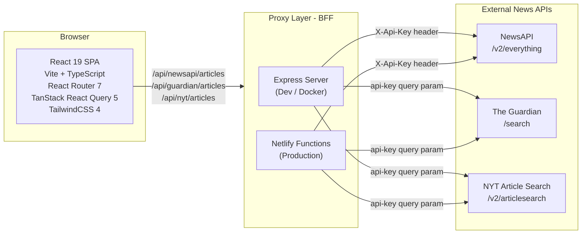
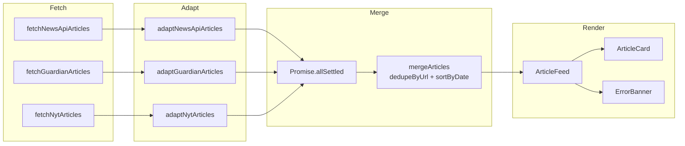
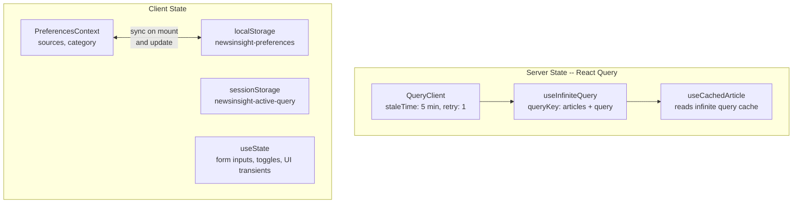
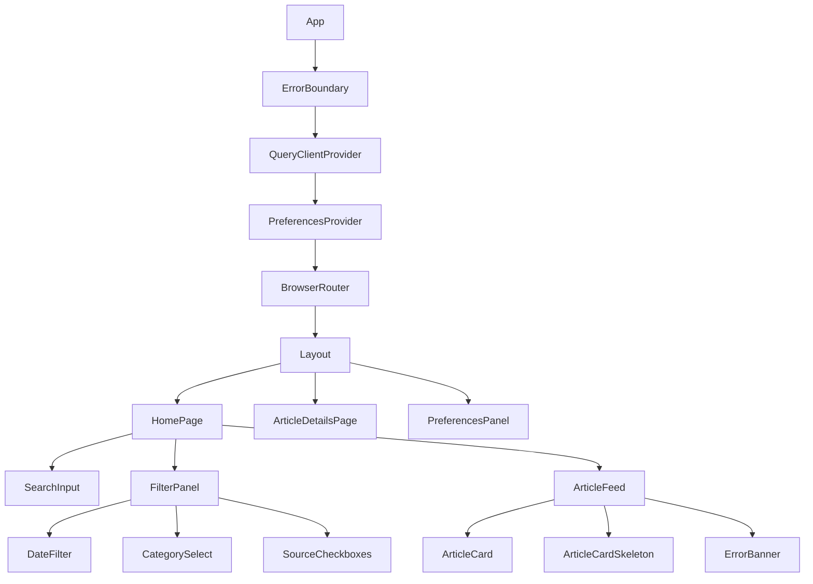
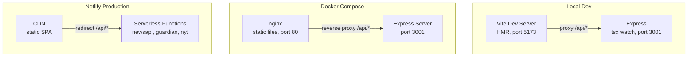

# NewsInsight -- Architecture Overview

> Reference document for the NewsInsight news-aggregator application.
> Covers system architecture, data flow, state management, component structure, and deployment.


---

## 1. System Architecture



### Design decisions

**Why a BFF proxy instead of calling APIs directly from the browser?**
- API keys stay server-side; the browser never sees them.
- Eliminates CORS issues -- the browser only talks to its own origin.
- The proxy is intentionally thin: no normalization, no caching, just auth injection and parameter mapping. This keeps the server stateless and trivially replaceable.

**Why two proxy implementations (Express + Netlify Functions)?**
- Both honour the same `/api/*` contract, so the frontend code is identical across environments.
- Express is convenient for local development (hot-reload via `tsx watch`) and Docker-based staging.
- Netlify Functions eliminate the cost of an always-on server in production -- they scale to zero automatically.

**Why these three sources specifically?**
- NewsAPI provides broad coverage across many publishers.
- The Guardian and NYT provide high-quality, editorial-grade journalism.
- Together they demonstrate handling three fundamentally different API response shapes, which is the core technical challenge.

---

## 2. Data Flow Pipeline



### Design decisions

**Why the Adapter pattern?**
Each API returns a wildly different JSON shape. Adapters act as an anti-corruption layer that normalizes everything into a single `Article` interface. UI components never import or reference provider-specific fields -- if a fourth source is added tomorrow, only a new adapter and fetch function are needed; zero UI changes.

```typescript
interface Article {
  id: string;
  source: 'newsapi' | 'guardian' | 'nyt';
  title: string;
  summary?: string;
  url: string;
  imageUrl?: string;
  publishedAt: string; // ISO 8601
  author?: string;
  category?: string;
}
```

**Why `Promise.allSettled` instead of `Promise.all`?**
Partial failure resilience. If the NYT API is down, `Promise.all` would reject the entire request and show nothing. `Promise.allSettled` lets Guardian and NewsAPI results render normally while `ErrorBanner` displays a per-source error message. This is modelled via a discriminated union:

```typescript
type SourceResult =
  | { source: Source; status: 'success'; articles: Article[]; total: number }
  | { source: Source; status: 'error'; error: string };
```

**Why deduplicate by URL?**
Two sources occasionally report the same story (e.g., a wire service article picked up by both NewsAPI publishers and the Guardian). Deduplicating by canonical URL ensures the feed never shows the same article twice.

---

## 3. State Management



### Design decisions

**Why React Query for server state instead of Redux/Context?**
React Query gives caching, background refetching, stale-time management, and infinite pagination out of the box. Putting API data in Redux or Context would mean re-implementing all of that manually. The rule is simple: if data comes from a server, React Query owns it.

**Why Context (not Redux) for preferences?**
Preferences are a small, flat object (`{ sources: Source[], category: string }`). React Context handles this cleanly without the boilerplate of actions, reducers, and a store. Redux is strictly forbidden -- the complexity is not justified at this scale.

**Why two different storage mechanisms (localStorage vs sessionStorage)?**
- `localStorage` for preferences: these are long-lived settings that should persist across browser restarts and tabs.
- `sessionStorage` for the active query (search term, date filters): these are ephemeral and should survive navigating to an article detail page and back, but reset when the user opens a new tab. This matches natural user expectations.

**Why `useCachedArticle` instead of a separate detail API call?**
The article detail page reads directly from the React Query infinite query cache. Since the normalized `Article` already contains all the fields we display, there is no need for a second network request. This makes navigation to detail pages instant.

**Why `staleTime: 5 min`?**
Prevents re-fetching on every component mount or window focus. News doesn't change second-by-second, and the external APIs have rate limits. Five minutes balances freshness against quota usage.

---

## 4. Component Architecture



### Design decisions

**Why feature-based folder structure?**
Files are grouped by domain feature (`articles/`, `filters/`, `preferences/`), not by technical role (`components/`, `hooks/`, `utils/`). Each feature directory is self-contained with its own components, hooks, types, constants, and co-located tests. This makes it easy to reason about a feature in isolation and reduces cross-directory imports.

**Why separate error handling strategies?**
- `ErrorBoundary` (React error boundary) catches unrecoverable rendering crashes -- corrupted state, null reference in a component tree, etc.
- `ErrorBanner` handles recoverable API-level errors per source -- it shows which source failed and offers a retry button.
- These are two fundamentally different failure modes that need different UX treatments.

**Why no god components?**
`HomePage` owns query state and composes `SearchInput`, `FilterPanel`, and `ArticleFeed` as siblings. `ArticleFeed` only renders -- it receives articles and source results as props. The fetching logic lives in `useArticles`. This separation keeps each component focused and testable.

**Why the render-time comparison pattern instead of `useEffect` for prop-to-state sync?**
When preferences change, `HomePage` needs to reset the query. Instead of a `useEffect` that triggers a re-render cycle, the render-time comparison pattern (`if (prevPrefs !== preferences) { ... }`) avoids the extra render and satisfies React hooks lint rules.

---

## 5. Deployment Architecture



### Design decisions

**Why three environments?**
- **Local dev** (Vite + Express): Fastest feedback loop. Vite gives instant HMR for the frontend; `tsx watch` auto-restarts the Express server on changes.
- **Docker Compose** (nginx + Express): Mirrors production topology locally. Catches environment-specific issues (nginx routing, multi-stage build problems) before they hit production.
- **Netlify** (CDN + Functions): Zero-ops production deployment. Static assets served from a CDN edge, serverless functions scale automatically, no infrastructure to manage.

**Why is the `/api/*` contract the key abstraction?**
The frontend always calls `/api/newsapi/articles`, `/api/guardian/articles`, and `/api/nyt/articles` -- regardless of environment. The routing mechanism differs (Vite proxy, nginx reverse proxy, Netlify redirects), but the contract is identical. This means no environment-specific code in the frontend.

**Why Docker multi-stage builds?**
The Node 22 Alpine base keeps images small. The build stage installs all dependencies and compiles TypeScript; the runtime stage copies only the compiled output and production dependencies. This reduces the final image size significantly.

**Why nginx in the Docker setup?**
nginx serves the static Vite build and reverse-proxies `/api/*` requests to the Express container. This mimics how a real production deployment would work (CDN for static assets, backend for API calls) and ensures the Docker environment is a faithful replica of production.

---

## Key Files Reference

| Area | Path | Purpose |
|------|------|---------|
| Domain types | `frontend/src/domain/types.ts` | `Article`, `ArticleQuery`, `SourceResult`, raw provider types |
| Adapters | `frontend/src/domain/adapters/` | One file per provider, normalizes to `Article` |
| Merge logic | `frontend/src/domain/merge.ts` | `dedupeByUrl`, `sortByDate`, `mergeArticles` |
| React Query hook | `frontend/src/features/articles/useArticles.ts` | `fetchAllArticles`, `PROVIDER_PIPELINES`, infinite pagination |
| Service layer | `frontend/src/services/api.ts` | `fetchJson`, per-source fetcher functions |
| Preferences | `frontend/src/features/preferences/` | Context, localStorage sync, types |
| Netlify functions | `frontend/netlify/functions/` | Serverless proxy (production) |
| Express routes | `server/src/routes/` | Express proxy (dev/Docker) |
| Docker | `docker-compose.yml`, `server/Dockerfile`, `frontend/Dockerfile` | Container orchestration |
| App entry | `frontend/src/App.tsx` | Provider tree, routing |
| Home page | `frontend/src/pages/HomePage.tsx` | Query state, filter composition, feed rendering |

---

## Testing Strategy

- **Adapters**: Unit tests feed raw JSON fixtures and assert normalized `Article` output. These are the most critical tests because adapters are the boundary between external instability and internal consistency.
- **Merge/Dedupe/Sort**: Unit tests verify correct ordering, duplicate removal, and handling of mixed success/error source results.
- **Components**: Render tests for `ArticleCard` (renders title, source badge, date) and `SearchInput` (triggers callback on debounced change).
- **Runner**: Vitest with React Testing Library, co-located with source files as `*.test.ts` / `*.test.tsx`.
